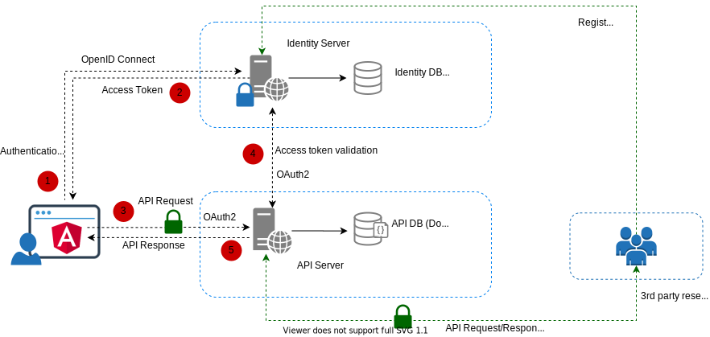

# emonitor


## Table of contents
 - [Architecture overview](#architecture-overview)
 - [Client application](#client-application)
 - [Server](#server)
 - [Local development](#local-development)
 - [Continuous Integration](#continuous-integration)
 - [Swagger](#swagger)
 - [Deployment architecture](#deployment-architecture)

## Architecture overview
[back to the contents](#table-of-contents)


Main components:

**Identity Server**: protects resosurces, authenticates clients, validates tokens, registers new users. OpenID Connect and OAuth 2.0 protocols are used

**Identity DB**: DB that stores user identities and operation data (codes, tokens etc.). The relational DB (SQL Server) is used here.

**API Server**: API resources (endpoints) that the client wants to invoke

**API DB**: DB that stores data for API functionality. The Document DB (MongoDB) is used here.

**Client**: Single Page Application that may be used to register/login and invoke API functionality

## Client application
[back to the contents](#table-of-contents)

The client application was implemented using [Angular](https://angular.io/). 

Please find detailed documentation about client application [here](./src/Client/Readme.md)

## Server
[back to the contents]

Backend applications were implemented using [.Net Core 3.1](https://dotnet.microsoft.com/download/dotnet-core/3.1). For unit and integration testing [xUnit](https://github.com/xunit/xunit) is used.

## Local development
[back to the contents](#table-of-contents)

For local development the `euro_monitor_db_dev` was provisioned on [mLab](Local development)


## Continuous Integration
[back to the contents](#table-of-contents)

The **Github Actions** are used for CI in this repository. There are 2 jobs: [Build SPA](https://github.com/Eugenio161288/emonitor/actions?query=workflow%3A%22Build+SPA%22) job builds client application and [Build .Net Core](https://github.com/Eugenio161288/emonitor/actions?query=workflow%3A%22Build+.Net+Core%22) job build server code and runs unit and integration tests.

## Swagger
[back to the contents](#table-of-contents)

[NSwag](https://github.com/RicoSuter/NSwag) is used for Swagger/OpenAPI specification in the API Server project (Euromonitor.Server.Api). Please use ```/swagger``` link for Swagger.

## Deployment architecture
[back to the contents](#table-of-contents)


This picture shows an example of the deployed solution. Please use [link](https://erspaproxy.azurewebsites.net) to try solution. 
[API Swagger link](https://erbooksonlineapi.azurewebsites.net/swagger) link for Swagger/OpenAPI specification of the hosted API.